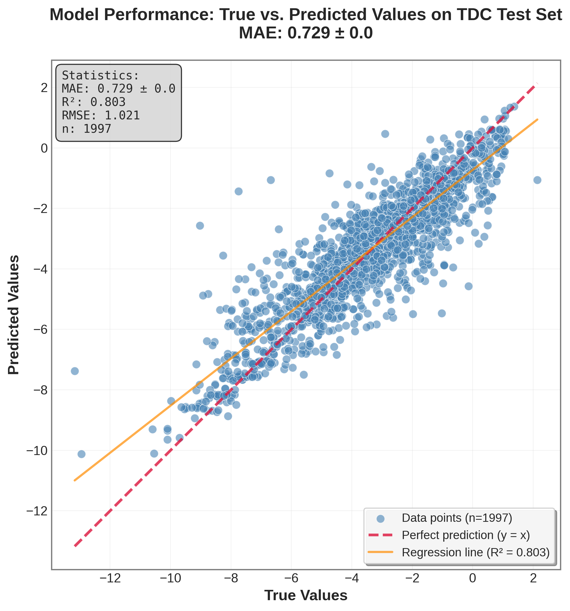
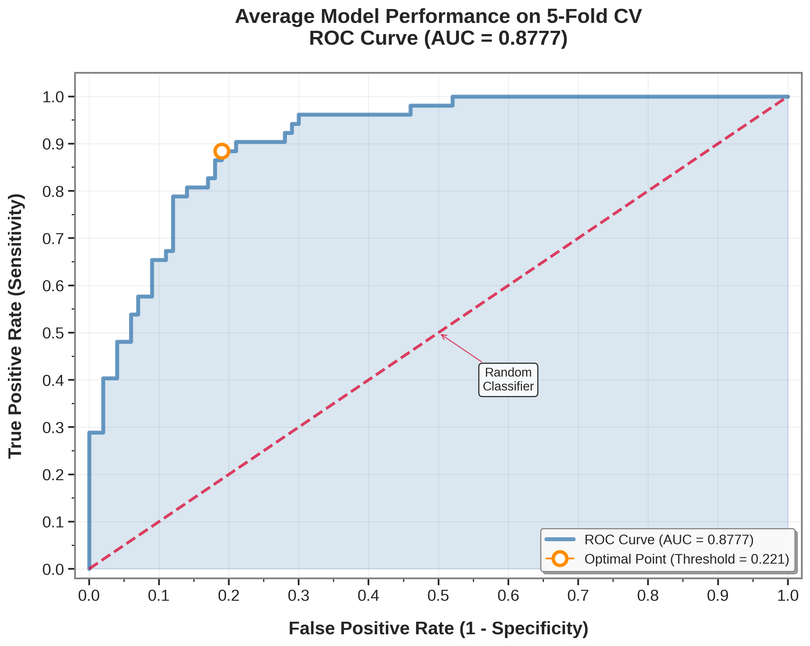
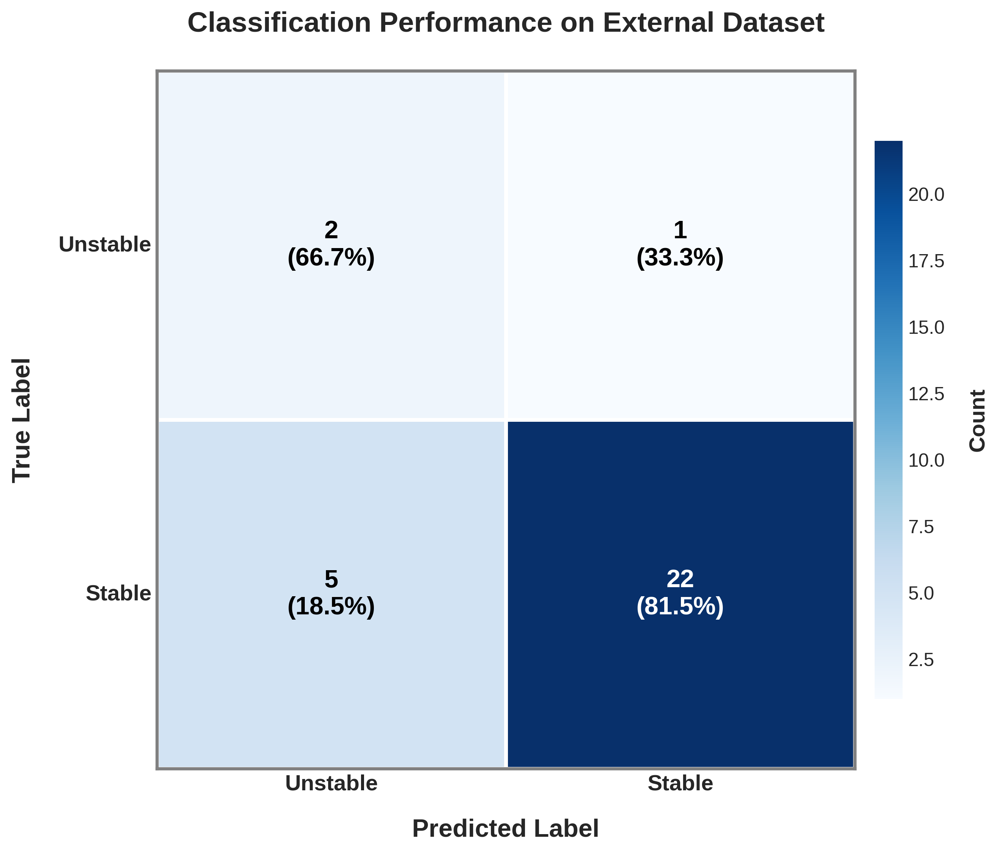

# Drug Solubility and Metabolic Stability Prediction

This repository contains code, datasets, and pretrained models for predicting **aqueous solubility** (regression) and **mouse liver microsomal (MLM) stability** (classification) of drug-like molecules using machine learning. The models are based on a unified molecular featurization pipeline and state-of-the-art gradient boosting algorithms.

## Overview

We implemented two models:

- **Solubility Prediction**: A LightGBM Regressor trained on the AqSolDB dataset (from [TDC Benchmark Suite](https://tdcommons.ai)).
- **MLM Stability Prediction**: An XGBoost Classifier trained on a curated dataset from Perryman et al. (2015), Journal of Pharmaceutical Sciences.

All feature generation is based on SMILES strings and uses a composite of:
- Morgan Fingerprints (1024-bit, radius=2)
- Avalon Fingerprints (1024-bit, count-based)
- ErG Pharmacophoric Fingerprints (315-bit)
- 200 RDKit Physicochemical Descriptors

## Results: Solubility (Regression) with LightGBM

| Task                | Metric      | Performance                   |
|---------------------|-------------|--------------------------------|
| Solubility (logS)   | MAE         | **0.729 ± 0.0**              |
|                     | R²          | **0.803**                      |

## Results: MLM Stability (Binary Classification) with XGBoost
| Task                | Metric      | Performance                   |
|---------------------|-------------|--------------------------------|
| MLM Stability       | ROC AUC     | **0.8777 ± 0.02** (CV)         |
|                     | Accuracy    | **80%** (External test set)  |

## Citation

All datasets, code, and models are also archived on Zenodo:
**\[DOI: 10.5281/zenodo.15616176]**

## License

MIT License.
